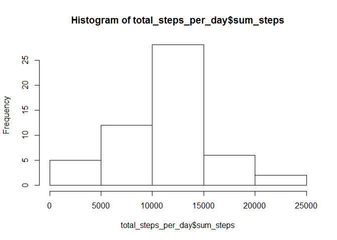
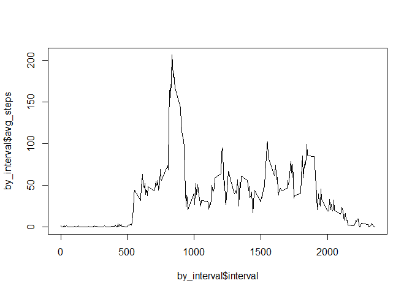
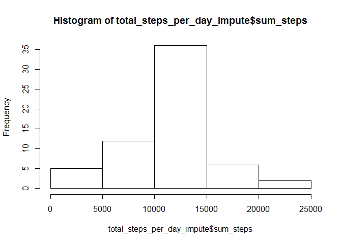
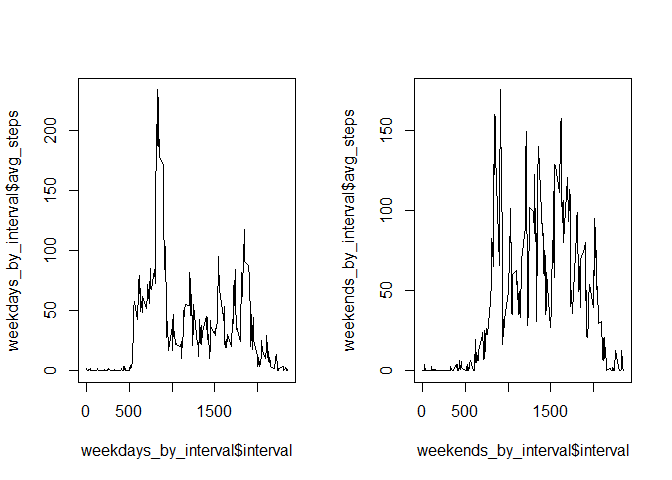

# Reproducible Research: Peer Assessment 1
## Installing packages
Please make sure that the package dplyr is installed on your system! It is needed for data manipulation steps.


```r
library(dplyr)
```

```
## Warning: package 'dplyr' was built under R version 3.1.3
```

```
## 
## Attaching package: 'dplyr'
## 
## The following objects are masked from 'package:stats':
## 
##     filter, lag
## 
## The following objects are masked from 'package:base':
## 
##     intersect, setdiff, setequal, union
```

## Loading and preprocessing the data
The following section reads in the raw data "activity.csv". The data should be stored in C:/R_dat !
Additionally the variable called "date" is converted in date-variable format with the help of the 
"as.Date"-function! A summary of the data set is presented.

```r
raw_data_act <- read.csv("C:/R_dat/activity.csv", stringsAsFactors=FALSE)
activity <- tbl_df(raw_data_act)
activity$date<-as.Date(activity$date,format="%Y-%m-%d")
summary(activity)
```

```
##      steps             date               interval     
##  Min.   :  0.00   Min.   :2012-10-01   Min.   :   0.0  
##  1st Qu.:  0.00   1st Qu.:2012-10-16   1st Qu.: 588.8  
##  Median :  0.00   Median :2012-10-31   Median :1177.5  
##  Mean   : 37.38   Mean   :2012-10-31   Mean   :1177.5  
##  3rd Qu.: 12.00   3rd Qu.:2012-11-15   3rd Qu.:1766.2  
##  Max.   :806.00   Max.   :2012-11-30   Max.   :2355.0  
##  NA's   :2304
```

## What is mean total number of steps taken per day?
The following program code calculates the number of steps per day. Therefore the data are grouped by date in the first step. After that the total number of steps per day is calculated with the help of the summarise function. Finally a histogram shows the distribution of the total number of steps over the days.
  
### Histogram

```r
daily_activity<-group_by(activity,date)
total_steps_per_day<-summarise(daily_activity,sum_steps=sum(steps))
hist(total_steps_per_day$sum_steps)     
```

 
  
### Arithmetic Mean

```r
mean(total_steps_per_day$sum_steps,na.rm = TRUE)
```

```
## [1] 10766.19
```
  
### Median

```r
median(total_steps_per_day$sum_steps,na.rm = TRUE)
```

```
## [1] 10765
```
  
## What is the average daily activity pattern?
The average daily activity pattern is the average value of steps in an interval, averaged over all days. Therefore the following steps are conducted:  
1. group activity data set by interval and save in data set "by_interval"  
2. calculate the mean steps per interval over all days  
3. plot the average daily activity pattern  

```r
by_interval <- group_by(activity,interval)
by_interval <- summarise(by_interval,avg_steps=mean(steps,na.rm=TRUE))
plot(by_interval$interval,by_interval$avg_steps,type="l")
```

 
  
## Imputing missing values
### Strategy and data set creation
We impute the missing values of each interval by taking into account the average daily activity pattern. This means that we replace the missing value for each interval by the average value for this interval over all days.  
Steps:  
1. create data set "impute" by merging "activity" and the average daily activity pattern data set "by_interval" by "interval" variable in data set "activity"  
2. calculate index vector; entries are the number of lines, where the step-values are missing  
3. in each of these line numbers, the missing value in the step variable (column 2) is replaced by the average daily activity value (column 4)  

```r
impute<-merge(activity,by_interval,by.x="interval")
miss_ind<-which(is.na(impute$steps),arr.ind=TRUE)
for (i in miss_ind){
        impute[i,2]=impute[i,4]        
}
```
  
### Histogram
see histogram text chunk from above for all steps. 

```r
daily_impute<-group_by(impute,date)
total_steps_per_day_impute<-summarise(daily_impute,sum_steps=sum(steps))
hist(total_steps_per_day_impute$sum_steps)     
```

 
  
The pattern of the histogram does not change because of the imputation strategy. The number of days in which 10000-15000 steps are performed increases, compared to the histogram with missing values.
  
### Arithmetic Mean

```r
mean(total_steps_per_day_impute$sum_steps,na.rm = TRUE)
```

```
## [1] 10766.19
```
### Median

```r
median(total_steps_per_day_impute$sum_steps,na.rm = TRUE)
```

```
## [1] 10766.19
```
  
Because of the imputation strategy the mean steps per day do not change compared to the calculation of the mean value. It makes no difference if missing values are deleted or replaced by the average daily activity pattern value.
  
## Are there differences in activity patterns between weekdays and weekends?
Steps:  
1. creating data set "activity_days"  
2. including the weekdays as factors with help of weekdays() function  
3. creating data set "activity_weekdays" for all weekdays (because of language settings, i use german weekdays) by filtering  
4. creating data set "activity_weekends" for all weekend-days (because of language settings, i use german weekdays) by filtering  
5. for each of this data sets: repeat the steps from the "average daily activity pattern" chunk above  
6. set graphics options for panel plot (1 row; 2 columns)  
7. plot average patterns  

```r
activity_days<-tbl_df(activity)
activity_days$day<-as.factor(weekdays(activity_days$date))
activity_weekdays<-filter(activity_days,day=="Montag" | day=="Dienstag" | day=="Mittwoch" | day=="Donnerstag" | day=="Freitag")
activity_weekends<-filter(activity_days,day=="Samstag" | day=="Sonntag")
weekdays_by_interval <- group_by(activity_weekdays,interval)
weekends_by_interval <- group_by(activity_weekends,interval)
weekdays_by_interval <- summarise(weekdays_by_interval,avg_steps=mean(steps,na.rm=TRUE))
weekends_by_interval <- summarise(weekends_by_interval,avg_steps=mean(steps,na.rm=TRUE))
par(mfrow=c(1,2))
plot(weekdays_by_interval$interval,weekdays_by_interval$avg_steps,type="l")
plot(weekends_by_interval$interval,weekends_by_interval$avg_steps,type="l")
```

 

